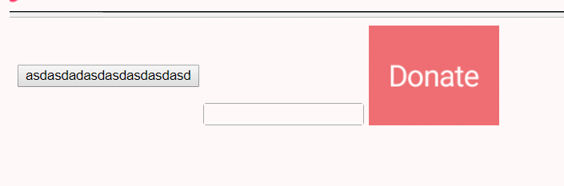

# 无敌effect效果
# effect like this



# how to use

```
  <link rel="stylesheet" href="./waves.css">
    <script src="./waves.js"></script>

    <class=" waves-effect">
```

## for  git 
```
git remote add origin https://github.com/lazyTai/waves-css-effect.git
git push -u origin master
``` 